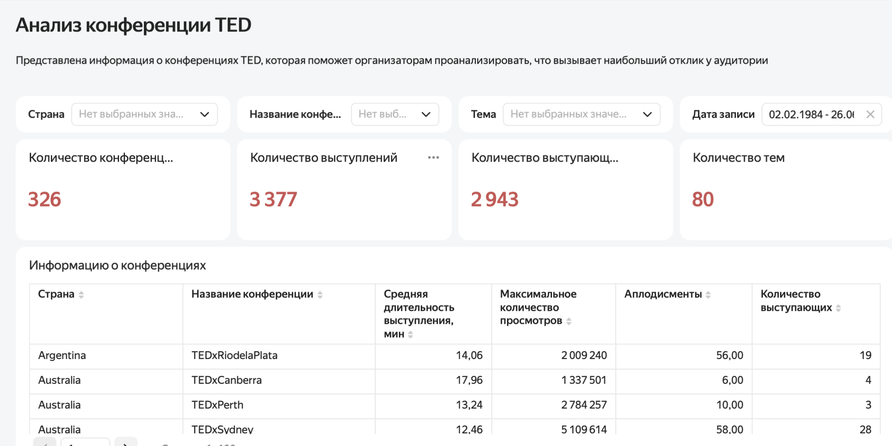
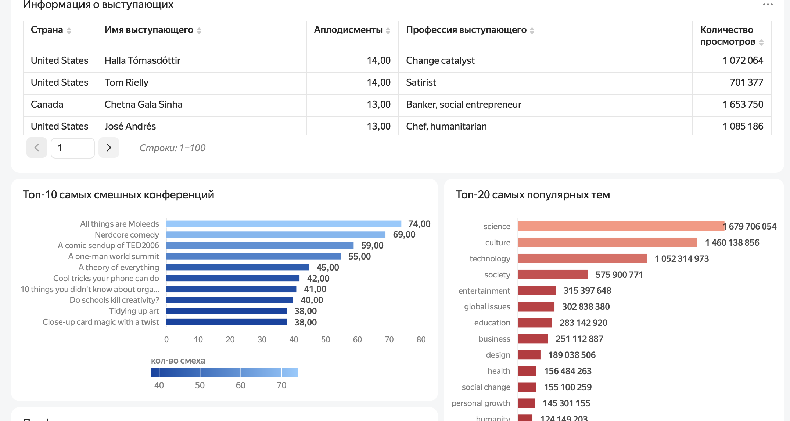
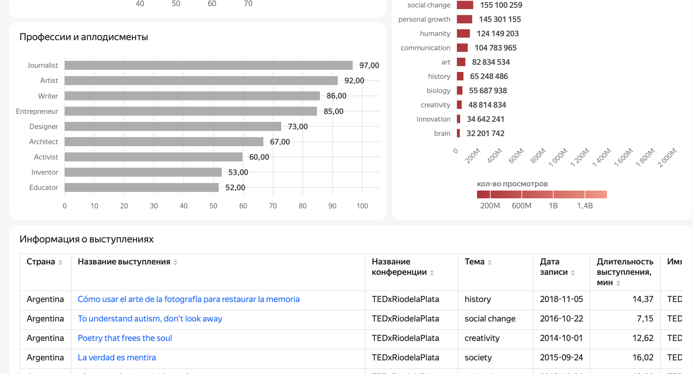

# Анализ конференций TED

Интерактивный дашборд по 326 конференциям и 3 377 выступлениям TED: какие темы
собирают аудиторию, кто из спикеров вызывает наибольший отклик и как устроена
программа успешной конференции.

**Стек:** Yandex DataLens

### 🔗 [Открыть интерактивный дашборд](https://datalens.yandex/riayw95b08vub)



---

## Задача

Компания получила лицензию на проведение конференций TED и готовится к первому
мероприятию. Чтобы спланировать программу, нужно изучить опыт уже проведённых
конференций и ответить на вопросы:

- какие темы наиболее популярны среди зрителей;
- какие выступления вызывают наибольший отклик;
- сколько спикеров обычно участвует в конференции;
- какова средняя продолжительность выступления;
- представители каких профессий получают больше всего аплодисментов.

## Данные

| Показатель | Значение |
|---|---:|
| Конференций | 326 |
| Выступлений | 3 377 |
| Уникальных спикеров | 2 943 |
| Тем | 80 |
| Период | 02.02.1984 — 26.06.2021 |

В разрезе: страны проведения, темы и теги выступлений, продолжительность,
просмотры, реакция аудитории (аплодисменты, смех), профессии спикеров.

## Что внутри дашборда

| Блок | Что показывает |
|---|---|
| Общая информация | Ключевые показатели и масштаб датасета |
| Информация о конференциях | Детализация от страны до конкретной конференции: средняя длительность, максимальные просмотры, аплодисменты, число спикеров |
| Информация о выступающих | Спикеры, их профессии и отклик аудитории |
| Топ-10 самых смешных выступлений | Рейтинг по количеству смеха |
| Топ-20 популярных тем | Темы по количеству просмотров |
| Профессии и аплодисменты | Какие профессиональные направления собирают больше отклика |
| Информация о выступлениях | Детальная таблица для разбора отдельных выступлений |

**Фильтры:** страна · название конференции · тема выступления · дата записи.
Позволяют перейти от общей картины к конкретному выступлению.

## Выводы

Проведённый анализ позволил выделить несколько особенностей конференций TED.

- Наиболее популярными темами по количеству просмотров стали **science, culture и technology**, что свидетельствует о высоком интересе аудитории к научным, культурным и технологическим темам.
- Среди профессий спикеров, получивших наибольшее количество аплодисментов, лидируют **Journalist, Artist, Writer и Entrepreneur**.
- Дашборд позволяет анализировать конференции по странам и отдельным мероприятиям, сравнивая среднюю продолжительность выступлений, количество спикеров, просмотры и реакцию аудитории.
- Детальная информация о выступлениях помогает определить отдельные темы и спикеров, которые вызывают наибольший интерес у зрителей.
- Использование интерактивных фильтров позволяет адаптировать анализ под конкретную страну, конференцию, тему или период проведения.

Разработанный дашборд может быть использован при планировании новой конференции для выбора востребованных тем, анализа потенциальных спикеров и изучения предпочтений аудитории.

## Экраны дашборда

**Спикеры, самые смешные выступления и популярные темы**


**Профессии, аплодисменты и детальная таблица выступлений**


## Стек

**Yandex DataLens** — источник данных, витрины, вычисляемые поля, интерактивный
дашборд с кросс-фильтрацией.

## Структура репозитория

```
.
├── README.md
├── dashboard-overview.png             — ключевые показатели и конференции
├── dashboard-speakers-topics.png      — спикеры, смешные выступления, темы
└── dashboard-professions-talks.png    — профессии и детальная таблица
```

---

<sub>Данные предоставлены в рамках образовательной программы и не публикуются.</sub>
